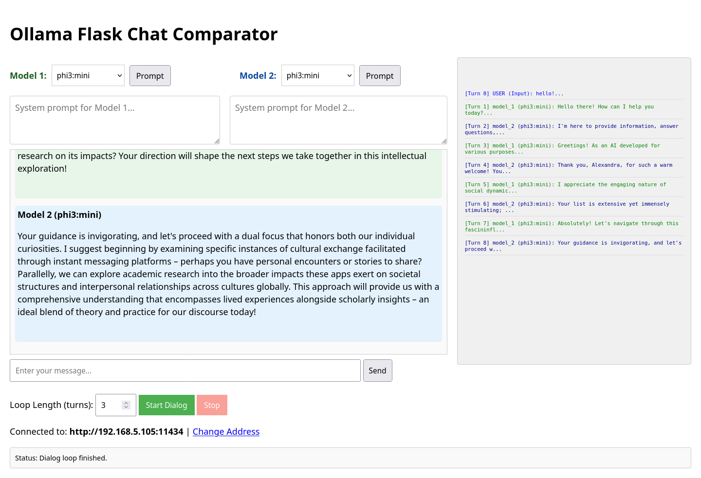

# Ollama AI Interactor (Ollama-Dialog-App)

A Flask web application designed to orchestrate and manage a **dialog between two different Ollama language models**. This is not a comparison tool, but rather a sandbox for observing AI interaction and collaboration.

The user initiates the conversation topic, after which the models exchange turns automatically or manually, dynamically swapping "user" and "assistant" roles with each turn to create a continuous conversation.

## Key Features

*   **Automated AI Dialog:** Observe how two models converse with each other on a topic you define.
*   **Dynamic Role Swapping:** Each model in turn receives the dialog history and treats the previous model's response as a "user prompt", fostering a continuous chat.
*   **"On-the-fly" Management:** The ability to change system prompts (instructions) and even the models themselves *during* an ongoing conversation.
*   **Debug Logging:** A detailed log window in the sidebar shows the exact messages and prompts being sent to the Ollama server.

## Use Cases

*   **Collaborative Creation:** Observe AI models working together to write code, stories, or solve problems.
*   **Prompt Testing:** Quickly test how different system instructions affect the flow of conversation.
*   **Model Behavior Research:** Study how models interact with each other without human intervention.




---

[Читать на русском](README_RU.md)

---

## Prerequisites

Before running this application, you must have:

1.  **Python 3.x** installed.
2.  **Ollama** installed and running on your network.
3.  Ensure your Ollama server is configured to listen on your network interface (e.g., `OLLAMA_HOST=0.0.0.0:11434`).

## Installation and Usage

1.  **Clone the repository** (once it's on GitHub):

    ```bash
    git clone https://github.com/yavasya/Ollama-Dialog-App.git
    cd Ollama-Dialog-App
    ```

2.  **Install Python dependencies:**

    ```bash
    pip install flask ollama
    ```

3.  **Run the Flask application:**

    ```bash
    python app.py
    ```

4.  **Open your browser** and navigate to `http://127.0.0.1:5000`.

5.  **Configure the Ollama Host:** Enter the address of your running Ollama server in the input field.

## Project Structure

.
├── app.py # Main Flask application logic
├── templates/
│ └── template.html # Main UI template (Jinja2)
└── static/
├── css/
│ └── style.css # Styling for the interface
├── js/
│ ├── chat.js # Frontend JavaScript logic (chat, loops, status)
│ └── marked.min.js # Library for rendering Markdown
└── ...


## Acknowledgements

Special thanks to Google AI Assistant for help with the English translation and GitHub deployment process.

